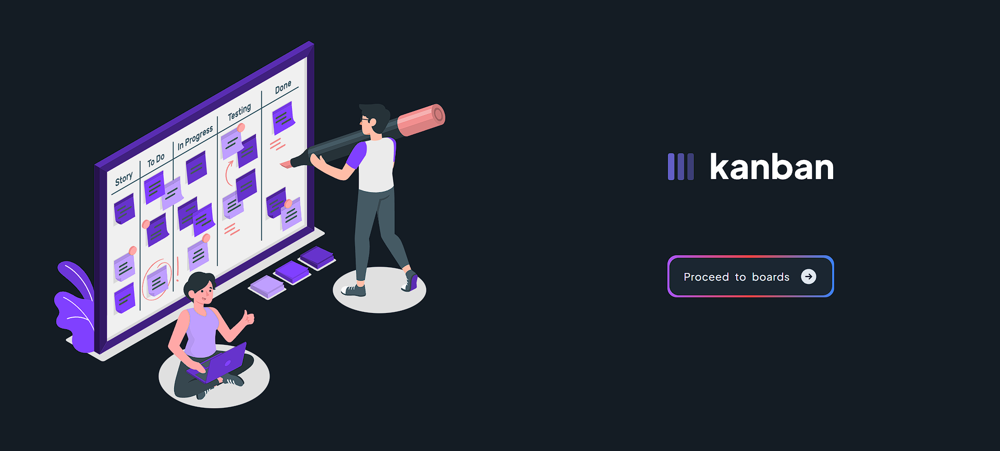
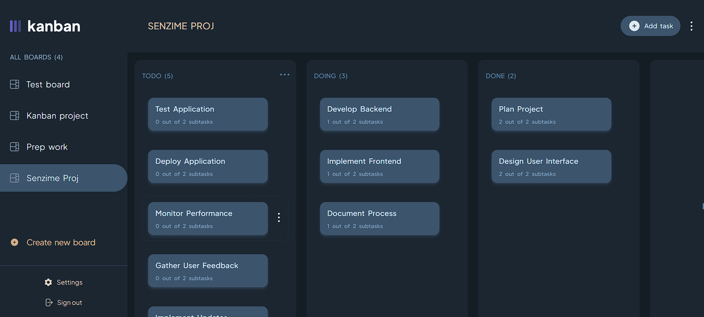
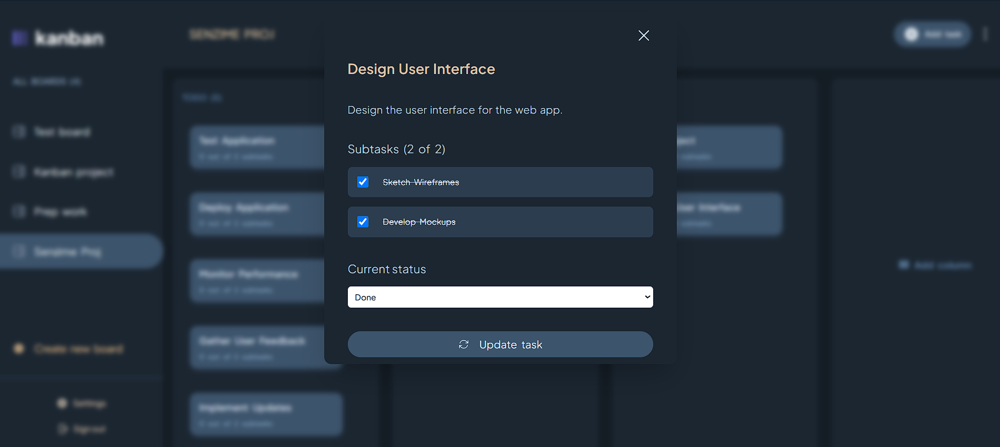
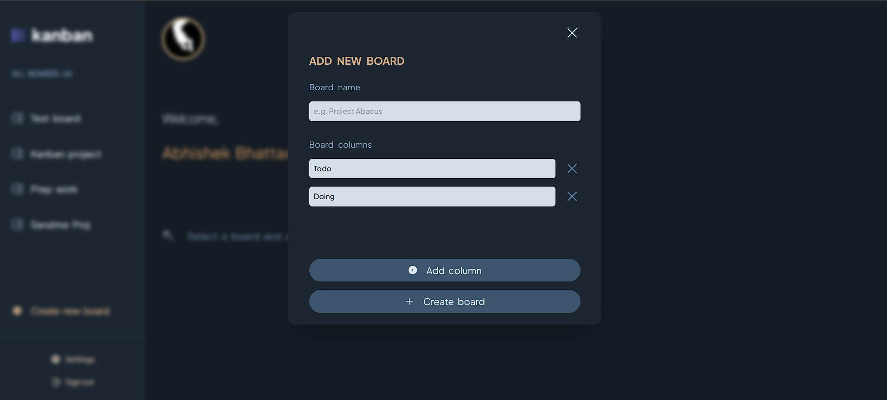
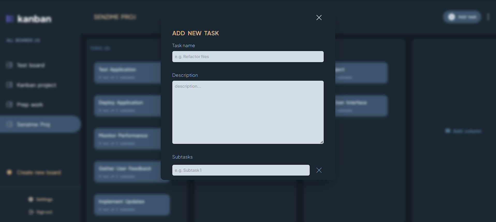
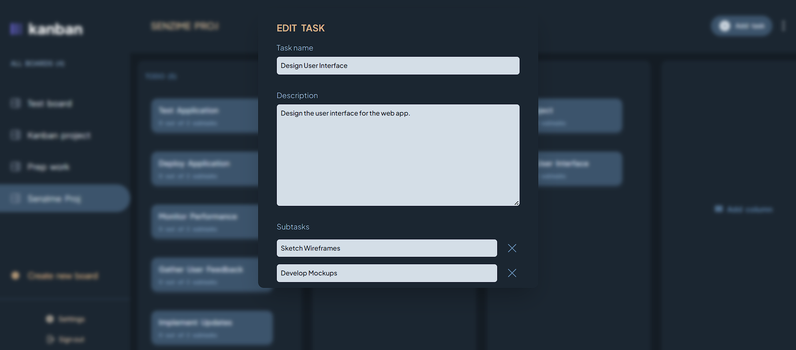
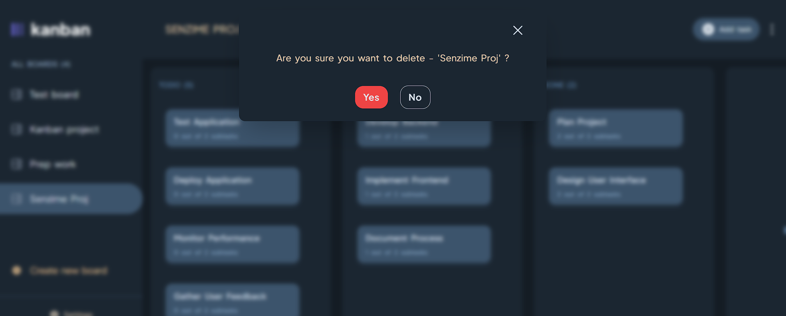
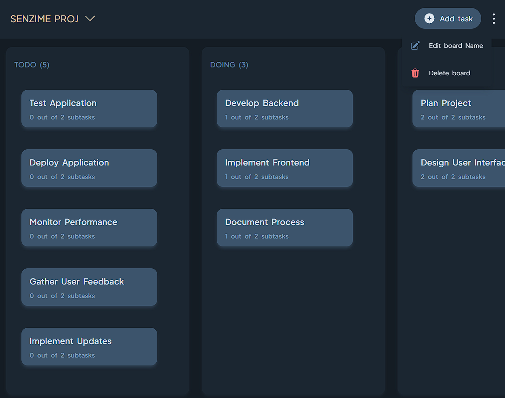
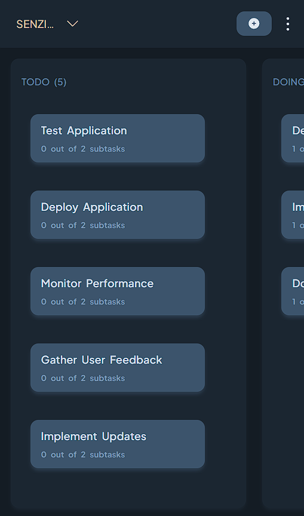

# Kanban task management

A Kanban task management web app is a digital platform that helps users organize and track tasks.





## Features

### 1. Boards

Create more boards, switch across boards and edit or remove a board, seamlessly.

### 2. Columns

Easily customize columns based on your workflow. Add, remove, or rename columns to suit your project needs.

### 3. Task

Users can view and edit task details, including task name, description, subtasks and status. Each subtask can be marked as completed.

## Libraries Used

- [react-hook-form](https://react-hook-form.com/) : Utilized for managing forms and handling user input efficiently.
- [tailwind css](https://tailwindcss.com/) : To design the web app.
- [next auth](https://next-auth.js.org/) : NextAuth.js is a complete open-source authentication solution for Next.js applications.

## Screenshots

1. **View task**



2. **Add Board**



3. **Add task**



4. **Edit task**



5. **Delete resource**



6. **Responsive**

- Tab view



- Mobile view



## Environment Variables

This project uses environment variables to manage sensitive information and configuration settings. The .env.local file contains variables for various services and credentials.

### Required Environment Variables

To set up the environment variables for this project, create a .env.local file in the root directory of your project and add the following variables:

```
NEXTAUTH_URL='http://localhost:3000'
NEXTAUTH_SECRET= your-nextauth-secret

AUTH_GOOGLE_ID= your-google-client-id
AUTH_GOOGLE_SECRET= your-google-client-secret

NEXT_PUBLIC_SUPABASE_URL= your-supabase-url
NEXT_PUBLIC_SUPABASE_KEY= your-supabase-anon-key
```
